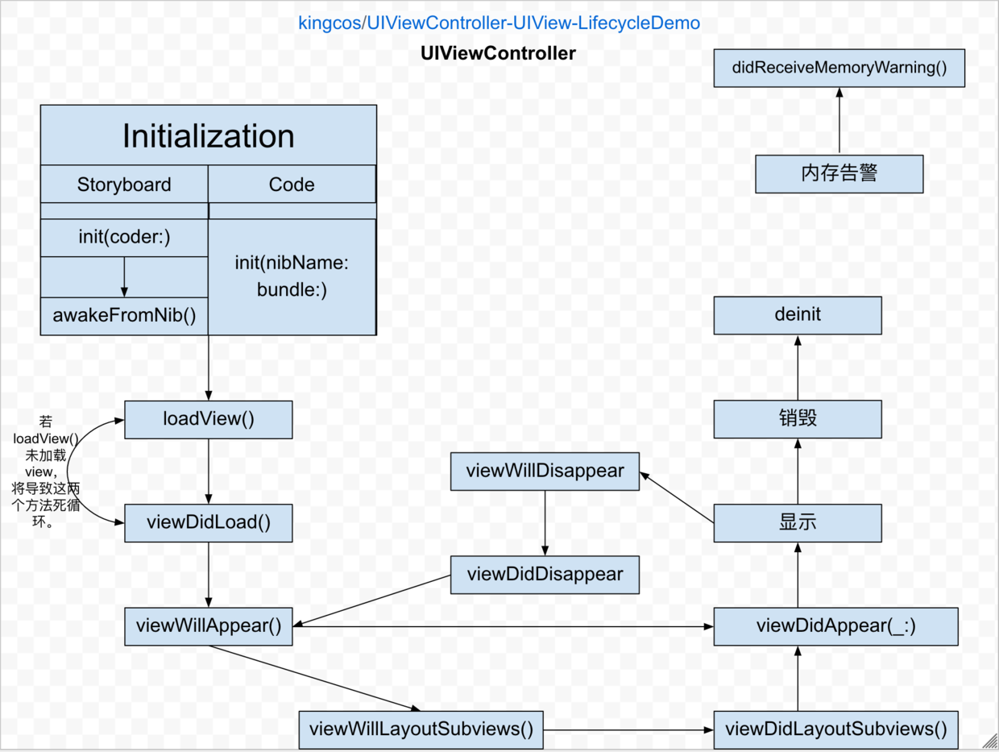

# UIViewController-UIView-LifecycleDemo

Find out the lifecycle of UIViewController &amp; UIView.

[中文版 README](README_CN.md)

## Info

- Xcode 12.5
- Swift 5.x

## Preface

Hi! This is a project about the lifecycle demos of UIViewController & UIView. You can download the whole project, and run it by Xcode. You can find out the results in Xcode console.

If you find any bugs or improvements, please issue me!

## Article

- [Find out the lifecycle of UIViewController(zh-CN)](https://kingcos.me/posts/2017/uiviewcontroller_life_cycle/)
- [Find out the initialization process of custom UIView(zh-CN)](http://www.jianshu.com/p/bfea8efee664)

## LICENSE

MIT
